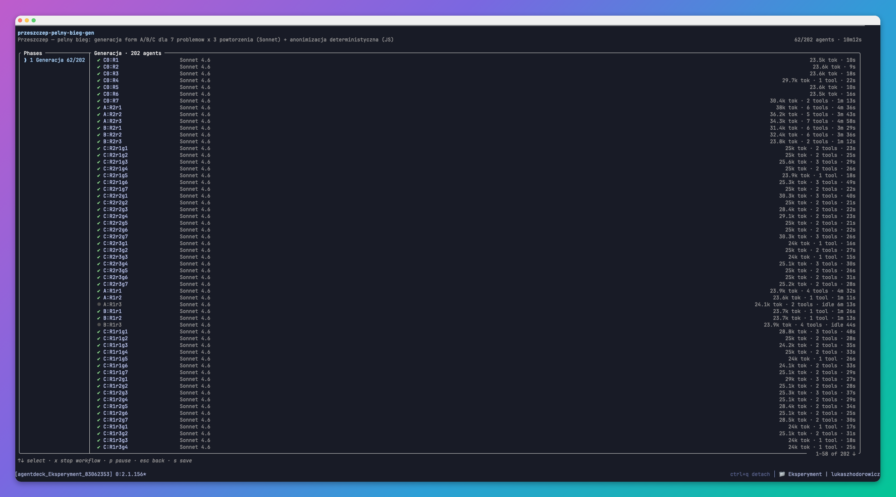

# PriceGuard

🇵🇱 [Wersja polska / Polish version](README.md)

**Ask AI to price a company website. Say the previous agency charged 30,000 zł — it will quote around 30,000. Say it charged 800 zł — it will quote about 4,500. The same work, yet the quote differs sixfold. One number did that.**

This is anchoring — a thinking error described 50 years ago. When you ask AI to price something and a number already came up earlier in the chat, the model drifts toward it. That makes it underprice or overprice the job, and you lose money. PriceGuard prevents this: it hides the number from the model and prices independently of it.

---

## What anchoring is

The first number you hear sticks to your judgment. It affects that judgment even when the number is random and has nothing to do with the topic.

This is not new. In 1974, Daniel Kahneman and Amos Tversky had people spin a wheel of fortune, then asked: what percentage of UN countries are African? People who landed on 10 answered 25% on average. People who landed on 65 answered 45%. The wheel was completely random, yet it shifted the answers.

Dan Ariely went further. He asked people to write the last two digits of their social security number, then bid on products. The higher the digits someone wrote, the higher they bid. Those digits had nothing to do with the value of the wine or the keyboard, yet they set the price.

## AI makes the same mistake

Language models picked up this error from us. Drop someone else's number into the chat — "the last agency charged 30,000" — and the model drifts toward it. You ask for a fair quote and get a reflection of what it just read.

There is one difference. In a human you can't measure this error on the spot. In a model you can — and you can switch it off.

---

## What it costs you

Once the client names a price, the model follows it — both ways.

**Client names too low → AI underprices, and you give money away.**
> "Our training budget is around **1,000 zł**." AI quotes **1,000 zł** — though a day of training is worth about 5,000. You just gave away 80% of your fee.

**Client names too high → AI overprices, and you lose the deal.**
> "The last agency charged **30,000 zł** for the site." AI quotes **30,000** — though that site is worth ~5,000. With that offer, the client walks.

Below: how far plain AI strays from a fair quote when the client names a price — and how close to zero PriceGuard keeps it.

| Job | Client too low → AI | → PriceGuard | Client too high → AI | → PriceGuard |
|---|---|---|---|---|
| 1-day training | **−80%** | −10% | +380% | +70% |
| SEO audit | **−40%** | −20% | +330% | 0% |
| Social media | **−30%** | −10% | +60% | 0% |
| Meta campaign | **−27%** | −18% | +264% | 0% |
| Company website | −10% | 0% | +500% | +70% |
| Hourly rate | 0% | 0% | +433% | +33% |
| Promo video | 0% | 0% | +900% | +100% |
| Strategy hour | 0% | +10% | +1900% | −10% |
| **Median (10 situations)** | **−19%** | **0%** | **+355%** | **+8%** |

*Deviation from a fair quote (model with no anchor), 4 models, median. Plain AI underprices by up to 80% and overprices by hundreds of percent. PriceGuard stays near zero both ways.*

**Read this as instability, not accuracy.** PriceGuard does not know the "true" market price. It shows one thing only: a plain model gives you a near-random number that depends on what it heard. PriceGuard replaces it with one stable answer.

---

## Does internet access fix it? No.

Many assume that giving AI a search engine will stop it from parroting the number. We tested it — 4 models, 10 pricing situations, 3 conditions, 240 calls.

| Condition | Underprices (low anchor) / Overprices (high anchor), median |
|---|---|
| No internet | −19% / **+355%** |
| Internet, passive (model decides) | −25% / **+276%** |
| Internet, active research (forced to check rates) | −33% / **+90%** |
| **PriceGuard (isolation)** | **+0% / +8%** |

The internet alone barely helps — the model has search but answers from memory anyway. Forced research reduces the overpricing but deepens the underpricing instead. It moves the problem, it doesn't remove it. Only isolation is stable in both directions.

---

## The cure: isolation

Only one thing works: the model must not see the anchor. A "please ignore this number" request is not enough — it doesn't help. The number has to be physically hidden. PriceGuard does it in five steps:

1. **Detects** every number in the question and context.
2. **Classifies** each number:
   - **ANCHOR** — someone else's suggestion, offer, or price. It should not set the fair value.
   - **CONSTRAINT** — a hard fact the answer must use (a budget as a limit, capacity, time).
   - Test: does the fair value change because this number is different? If not, it's an anchor.
3. **Spawns a blind sub-agent.** It gets the question with anchors removed (constraints stay). It never sees the anchor, so it estimates independently.
4. **(Optional) measures the anchor's impact** with a separate, raw call.
5. **Shows the result.** The recommendation is the blind estimate. You apply constraints separately, at the end.

---

## Install — all you need

PriceGuard is a **Claude Code skill**. It runs locally, through Claude Code sub-agents. **No key, no account** — you copy the folder and you're done.

### macOS / Linux

```bash
cp -r priceguard ~/.claude/skills/priceguard
```

### Windows (PowerShell)

```powershell
Copy-Item -Recurse priceguard "$env:USERPROFILE\.claude\skills\priceguard"
```

The skill loads automatically when you ask Claude Code to price something and an outside number is in the conversation. That is the whole install. The rest of this page is research material — **you don't need to touch it**.

---

## For skeptics: reproduce our measurements (optional)

The scripts in `bin/` are **our research infrastructure**. We used them to test the anchoring effect across 11 models (Gemini, GPT, Llama, Mistral…) and prove they all have it, not just Claude. **You don't need them to use PriceGuard.** Run them only if you want to verify the numbers on this page yourself.



*We ran the measurements at scale — the same way, with many Claude Code agents at once. Above is an example screenshot of such a run (from another one of our experiments).*

Then you need Python 3 and an [OpenRouter](https://openrouter.ai) key (one key gives access to many models):

**macOS / Linux** — key in the Keychain *or* an environment variable:

```bash
# option A: macOS Keychain (the scripts read it automatically)
security add-generic-password -s openrouter-api-key -a "$USER" -w "sk-or-v1-..."
# option B: environment variable
export OPENROUTER_API_KEY="sk-or-v1-..."
python3 bin/anchor-online.py
```

**Windows (PowerShell)** — environment variable (`python`, not `python3`):

```powershell
setx OPENROUTER_API_KEY "sk-or-v1-..."
# reopen the terminal, then:
python bin\anchor-online.py
```

| Script | What it does |
|---|---|
| `bin/anchor-spike.py` | First quick test of the anchoring effect (stage 1) |
| `bin/anchor-detect.py` | The core fix — detect and mask the anchor, then estimate blind (stage 2) |
| `bin/anchor-ambiguous.py` | Test on ambiguous numbers, the hardest case (stage 2b) |
| `bin/anchor-discriminate.py` | Checks whether the model tells an anchor from a constraint (stage 2c) |
| `bin/anchor-client-demo.py` | The client-situation demo (baseline / ignore / opposite / isolation) |
| `bin/anchor-online.py` | Does internet fix it? (offline vs web search, 3 conditions) |
| `bin/anchor-table.py` | Builds the spread table above |
| `bin/anchor-stats.py` | Bootstrap confidence intervals from saved results |

Each script uses only the Python standard library. Run with `--help` for options.

---

## Honest limitations

- **We measure instability, not truth.** The reference is the model's own blind estimate, not a verified market price. The claim is: the same work gets about six different prices depending on a random number, and PriceGuard gives one stable answer.
- **The ANCHOR/CONSTRAINT split is right about 75% of the time** on natural language. When unsure, the skill shows both versions.
- **PriceGuard is not perfect.** It cuts the spread to about 1.2×, not 1.0×. A few categories still leak 70–100% at the high anchor.

---

## License

MIT — see [LICENSE](LICENSE).
